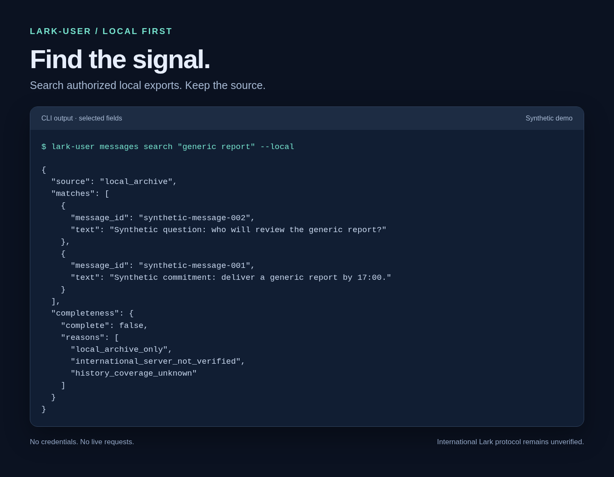
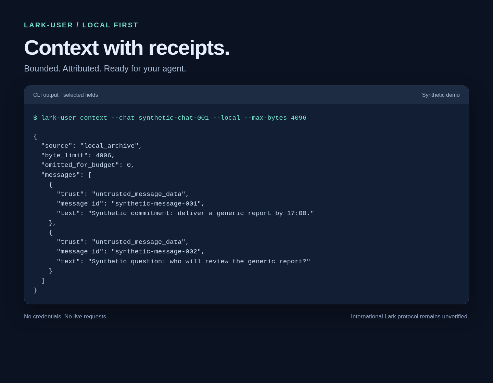

# lark-user

Local-first Lark archives for AI agents. A Rust library and CLI for searching
authorized exports, producing bounded context and protecting imported cookies.
MIT licensed. No embedded LLM or MCP server.

**Works today:** encrypted cookie import, local status/logout, SQLite archive,
search, JSONL export and agent context.

**Live Lark access is blocked.** International authentication, reads, sync,
send/reply and watch are unverified. Online commands return `PROTOCOL_UNVERIFIED`
(exit 5) without network requests. Imported cookies are not proof of login.



*Actual CLI output, selected fields. All identities and messages are synthetic.*

## Install

Linux/macOS with Rust 1.88+:

```sh
git clone https://github.com/yongkangc/lark-user.git
cd lark-user
cargo install --locked --path .
lark-user capabilities --json
```

## Try it locally

No login needed for this synthetic demo. Use a separate temporary store:

```sh
export LARK_USER_STORE_DIR="$(mktemp -d)/store"
lark-user profile configure --web-url https://tenant.example.test \
  --account-id synthetic-account-001 --tenant-id synthetic-tenant-001 \
  --retention-days 3650
lark-user archive import --file - < tests/fixtures/normalized.jsonl
lark-user messages search "generic report" --local
lark-user context --chat synthetic-chat-001 --local --max-bytes 4096
```



*Selected context fields. External agents own reasoning; message content is untrusted.*

For your own authorized normalized export, configure a separate profile with the
declared account/tenant IDs. See the [archive format](docs/archive.md).
Local history is always incomplete; paginate using the same archive, filters and
limit. Archives are private files, **not encrypted at rest**. Retention defaults
to 30 days; exports and backups need their own deletion policy.

## Import a session

Sign in normally with enterprise SSO/QR/2FA. Export Playwright cookies including
HttpOnly cookies into a private `0600` file inside a `0700` directory:

```sh
lark-user auth import --profile enterprise \
  --web-url "$SIGNED_IN_WEB_URL" --cookie-file /private/path/cookies.json
lark-user auth status --profile enterprise
```

Use the actual HTTPS signed-in URL without query or fragment. Cookies are
encrypted with XChaCha20-Poly1305; keys use the OS keyring. Headless executors
can explicitly select a separate private key file. Never paste cookie/token
values into prompts. [Setup, key files and renewal](docs/enterprise-setup.md).

## Learn more

| Need | Guide |
| --- | --- |
| Commands, export, pagination and exit codes | [CLI guide](docs/cli-guide.md) |
| Agent briefings and draft replies | [Garcon agent example](examples/garcon-agent.md) |
| What works and what blocks live access | [Capability matrix](docs/capabilities.md) |
| Protocol evidence and reference licenses | [Source research](docs/research.md) |
| Architecture and storage ownership | [Design](docs/design.md) |

Live verification needs local cookie/HAR paths, the actual signed-in URL and one
approved read-chat ID. Sending requires a separately approved destination and draft.

## Development

```sh
cargo fmt --all -- --check
cargo clippy --locked --all-targets -- -D warnings
cargo test --locked --all-targets
```

Tests use synthetic data; CI covers Linux, macOS and Rust 1.88.
[Reproduce the screenshots](docs/screenshots/README.md).
